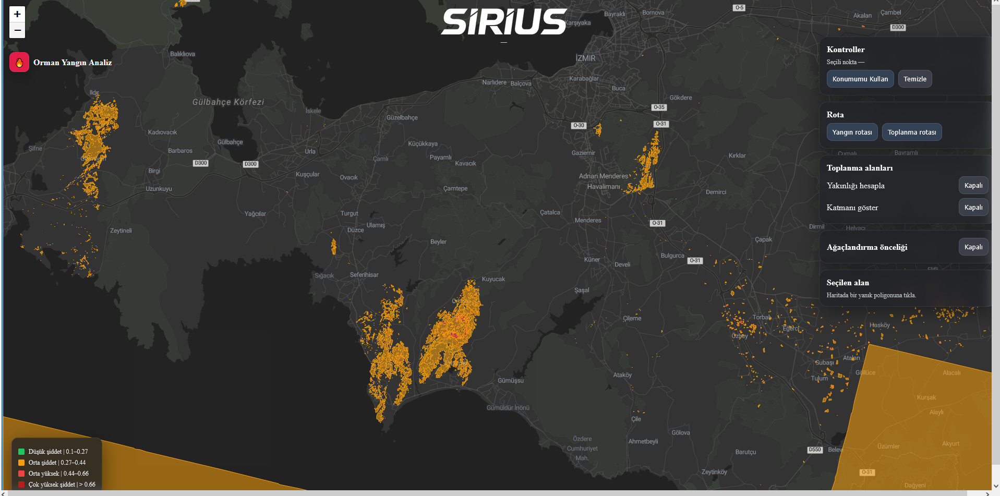
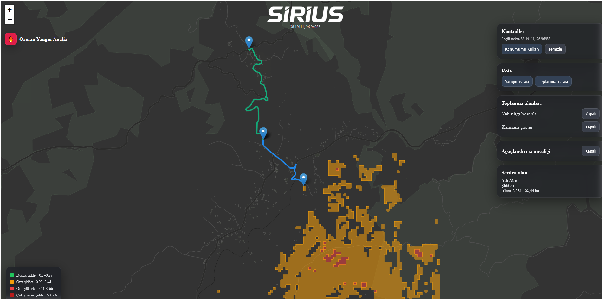

# SIRIUS – Afet Harita Uygulaması


TEKNOFEST Geleceğin Sürdürülebilir Şehirleri Hackathonu için geliştirilmiştir.  
Aşağıda **demo**, **kurulum** ve **.env** bilgileri yer alır.

## 🔗 Bağlantılar
- **GitHub Repo:** (https://github.com/KVRIND3S3N/afet-map)




## 🧱 Proje Yapısı

```bash
afet-map/
├── backend/                  # API (Python + Flask)
│   ├── data/                 # Veri setleri
│   │   ├── dnbr_5class.tif
│   │   ├── izmir_toplanma.csv
│   │   └── izmir_toplanma_alanlari.geojson
│   ├── outputs/              # Çıktılar
│   │   ├── verify/
│   │   │   ├── dnbr_classes_5.png
│   │   │   ├── dnbr_hist.png
│   │   │   └── nbr_before_after.png
│   │   ├── burn_polys.gpkg
│   │   ├── dnbr_5class.tif
│   │   ├── dnbr_5class_quicklook.png
│   │   ├── risk_distance_full.png
│   │   ├── risk_distance_zoom.png
│   │   ├── toplanma_risk_by_distance.csv
│   │   └── toplanma_risk_by_distance.geojson
│   ├── .env.example
│   ├── app.py
│   ├── csv2geojson_izmir.py
│   ├── dnbr.py
│   ├── dnbr_old.py
│   ├── intersect.py
│   ├── load_assembly_to_pg.py
│   ├── load_burn_polys_to_pg.py
│   ├── make_burn_polys.py
│   ├── requirements.txt
│   ├── verify_dnbr.py
│   └── visualize.py
├── public/                   # Statik dosyalar
│   ├── SIRIUS.png
│   ├── arayüz.png
│   ├── vite.svg
│   └── yol.png
├── src/                      # Frontend (Vite + React)
│   ├── assets/
│   │   └── react.svg
│   ├── App.css
│   ├── App.jsx
│   ├── index.css
│   └── main.jsx
├── .gitignore
├── README.md
├── eslint.config.js
├── index.html
├── package-lock.json
├── package.json              # Vite + React bağımlılıkları
└── vite.config.js
```
---

## ✨ Özellikler
- Harita üzerinde yangın alanları (GeoJSON) ve rotalama
- “Ağaçlandırma önceliği” modu (renklendirme + legend)
- Toplanma alanı yakınlığına göre dinamik skor
- *React + Leaflet* ile hızlı arayüz (Vite)

---

## 🧪 API Uçları
Frontend şu uçları çağırır:
- `GET /api/burn-areas?mode=polys` → **GeoJSON** (yanık poligonları)
- `GET /api/assembly-areas?bbox=minX,minY,maxX,maxY` → **GeoJSON** (toplanma alanları)
- `GET /api/route-to-fire?lat=..&lon=..` → **FeatureCollection** (origin/destination/line)
- `GET /api/route-to-assembly?lat=..&lon=..` → **FeatureCollection**

> Rota için `features[].properties.role ∈ {origin, destination, line}` ve  
> `line.properties.distance_km|distance_m` alanları beklenir.

---

## ⚙️ Çevresel Değişkenler (.env)
- Frontend için `.env.sample` (opsiyonel) kök dizinde yer alır.  
- Backend için `backend/.env.sample` dosyası eklenmiştir.


---

## 🧰 Versiyonlar
- **Node.js (frontend için):** 18.x veya 20.x  
- **Python (backend için):** 3.10+  
- **Paket yöneticisi:** npm (frontend), pip (backend)

---

## 🚀 Kurulum ve Çalıştırma

### Frontend (React + Vite)
```bash
npm install
npm run dev
```
### Backend (Python + Flask)
```bash
cd backend
pip install -r requirements.txt
python app.py
```

## 🗄️ Veritabanı (PostgreSQL + PostGIS)

- Uygulama **PostgreSQL 14+** ve **PostGIS** eklentisi ile çalışır.  
- Veritabanı adı: `afet` 
- Gerekli tablolar:
  - `burn_polys` → yangın alanları (geometry sütunu: `geometry`)
  - `assembly_areas` → toplanma alanları (geometry sütunu: `geometry`)

  ### Veri yükleme
Backend klasöründe veri yüklemek için yardımcı scriptler mevcuttur:
- `load_burn_polys_to_pg.py` → Yanık alanlarını PostGIS'e yükler   
- `csv2geojson_izmir.py` → CSV verisini GeoJSON’a dönüştürür  

## 📂 Veri Kaynakları

Uygulamanın çalışması için PostGIS veritabanında **yanık alanları** ve **toplanma alanları** tablolarının doldurulması gerekir.  

### 🔥 Yanık Alanları (`burn_polys`)
- Kaynak dosya: `dnbr_5class.tif` (uydu görüntüsünden türetilmiş yanık sınıf rasteri)
- Adımlar:
  1. `make_burn_polys.py` scripti ile raster → poligon dönüşümü yapılır.
  2. `load_burn_polys_to_pg.py` scripti ile poligonlar PostGIS veritabanındaki `burn_polys` tablosuna yüklenir.

### 🏕️ Toplanma Alanları (`assembly_areas`)
- Kaynak dosya: `toplanma_risk_by_distance.geojson` (veya CSV versiyonu)
- Adımlar:
  1. `load_assembly_to_pg.py` scripti ile GeoJSON’daki alanlar PostGIS veritabanındaki `assembly_areas` tablosuna yüklenir.

### 📌 Özet
- **Gerekli tablolar:**
  - `burn_polys (geometry, class, …)`
  - `assembly_areas (geometry, ADI, ILCE, MAHALLE, YOL, KAPINO, …)`
- Eğer tablolar boş ise backend API uçları boş GeoJSON döndürür (hata değildir).


## ⚙️ Ortam Değişkenleri

- Backend klasöründe bir `.env.sample` dosyası vardır.  
- Bu dosyayı kopyalayıp `.env` olarak adlandırın.  
- İçindeki değerleri kendi bilgisayarınıza uygun olacak şekilde düzenleyin.  

Örnek (`backend/.env.sample`):
